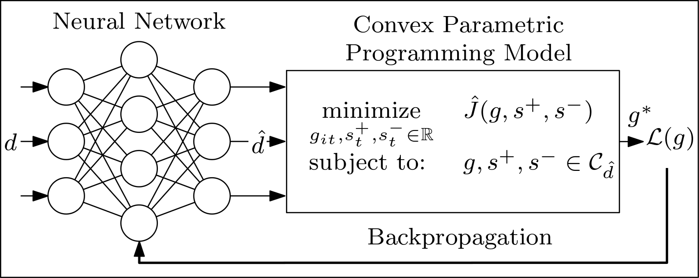

# Differentiable Convex Optimization for Decision-making

This project explores the use of embedding differentiable convex optimization layers in neural networks to train prediction models that optimize application-specific metrics. In particular, this project focused on the economic dispatch problem, a scheduling problem in power grids. The model can train a prediction model that optimizes metrics such as the CapEx or ramping reserve.

**Running the model:** Use diffcvx.py to run the model. It is highly recommended to initialize the network with weights of a network that was trained to minimize the mean squared error, as this reduced the chances of getting stuck in local minima from our experience.

    Trains a prediction model for the economic dispatch problem using differentiable convex optimization layers.
    
    options:
      -h, --help            show this help message and exit
      --history_horizon history_horizon
                            Number of historical hours used as input features to the forecasting model.
      --forecast_horizon forecast_horizon
                            Number of future hours to forecast.
      --loss loss           Loss function to use during training; options include 'capex', 'prediction_error', 'ramping_reserve'.
      --num_layers num_layers
                            Number of layers in the neural network model.
      --train train         Flag indicating whether to train the model or not; set to False for inference only.
      --num_hidden num_hidden
                            Number of neurons in each hidden layer of the network.
      --num_epochs num_epochs
                            Number of training epochs.
      --batch_size batch_size
                            Batch size for training.
      --lr lr               Initial learning rate for training.
      --device device       Device to use ('cpu' or 'cuda').
      --lambda_plus lambda_plus
                            Penalty cost per unit of energy for overestimation.
      --lambda_minus lambda_minus
                            Penalty cost per unit of energy for underestimation.
      --training_dir training_dir
                            Path to the training data file.
      --testing_dir testing_dir
                            Path to the testing data file.
      --system_dir system_dir
                            Path to the system configuration file in JSON format.
      --save_dir save_dir   Directory to save trained models and logs.
      --name name           Name under which the model and associated files are saved.
      --load_dir load_dir   Path from which to load a pre-trained model for further training or inference.

**Downloading the data:** Use data.py to download energy demand time series for the CAISO network.
 
    Downloads CAISO data
    
    options:
      -h, --help            show this help message and exit
      --train_start_date train_start_date
                            enter the start date for training data (e.g., January 1, 2023)
      --train_end_date train_end_date
                            enter the start date for training data (e.g., January 1, 2023)
      --test_start_date test_start_date
                            enter the start date for testing data (e.g., January 1, 2023)
      --test_end_date test_end_date
                            enter the start date for testing data (e.g., January 1, 2023)
      --save_dir save_dir   enter location where to save the data
      --normalization normalization
                            enter a value to normalize the data with
